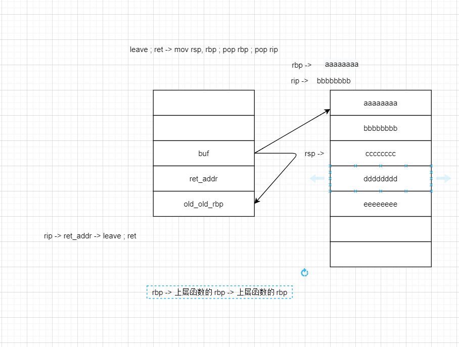

# stack_migration

rsp 被迁移到另外的地方

因此，在这道题目中，我们可以现在 name 上布置 rop 链，同时利用栈溢出修改 rbp 和 ret_addr 。修改 rbp 为 name 地址，修改 ret_addr 为 leave ; ret 指令

在 system 函数执行时候，会大量消耗栈资源，所以我们要控制好迁移后的栈地址，让 system 函数能过正常地执行